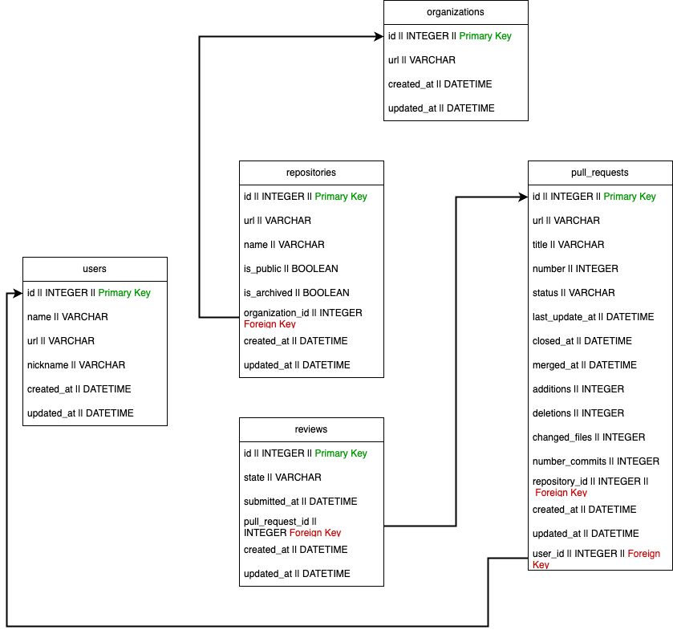

# GitHub Organization Scraper

This application scrapes data from any GitHub organization and stores it in a SQLite3 database using Rails.

---

## Overview

The scraper performs the following:

- Connects to a GitHub organization page.
- Scrapes repositories sequentially.
- Saves repositories in batches using `upsert_all`.
- Collects all pull request URLs per repository.
- Scrapes pull requests concurrently across threads.
- Scrapes users concurrently.
- Enriches and saves pull requests.
- Scrapes and saves reviews.
- Rate Limiter is included in the project (check lib/utils).

Logging is directed to timestamped files under `log/` for traceability.

---

## Background

Earlier versions of this scraper worked entirely sequentially. This resulted in significant delays, sometimes exceeding 24 hours for large organizations.

Key bottlenecks:
- Sequential HTTP requests.
- Row-by-row database inserts.

**Optimizations introduced:**

- Migration to Rails for ease of migrations and bulk operations.
- Use of `upsert_all` for batch inserts.
- Concurrency via thread pools with `Concurrent::ThreadPoolExecutor`.
- Mutex-protected access to shared data structures to avoid race conditions.

Final design:
- Repositories are fetched sequentially.
- Pull requests are fetched concurrently, scoped to each repository.
- Users are fetched concurrently.
- Data stored in a SQLite3 database.

---

## Running the Scraper

Default usage:

```
rails runner lib/app.rb --org vercel
```

Limit scraping for testing:

In `extract_repositories_data`, uncomment:

```ruby
break if repositories_data.length >= 10
```

---

## Data Model

The database schema models the following relations:

### Entities and Relationships

The arrows represent [1-to-N] relationships.


